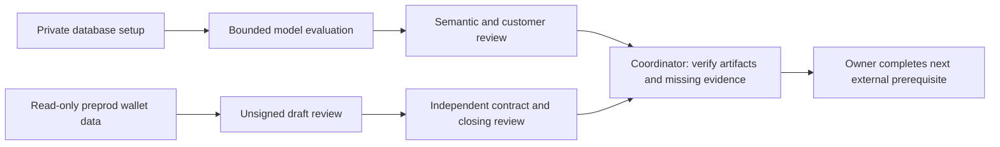

# MEW activation team

This workflow uses three specialist engineering lanes and a coordinating reviewer.
It improves the pending activation work without adding production runtime roles or
altering the deterministic economic kernel. The actual Codex agents used for this
contribution were database activation, model activation and the resumed security
reviewer working on the current payment integration. Their procedures live in four
new repository-local skills, including the coordinator.

| Lane | Deliverable | Receives | Hands off | Authority |
| --- | --- | --- | --- | --- |
| Private database | Secure operator setup, least-privilege connection and hosted race verification procedure | Selected project/schema, reviewed operator scope | Hashed enrollment, sanitized connection/test receipts | Local setup only; no automatic hosted LOGIN or schema change |
| Model evaluation | Provider fixture run, separate frozen benchmark and semantic/customer review | Prompt/data/model digests and bounded approved provider config | Format, grounding, abstention and outcome evidence kept distinct | Advisory evaluation; no model activation or payment tools |
| Preprod payments | Public-address observations, unsigned-draft review and closing/audit gaps | Immutable intent/draft, enrolled public addresses, trusted preprod indexer | Wallet observation and lifecycle/audit blockers | Read-only chain calls; no seed, signature, broadcast or native-token spend |
| Coordinator | Shared handoff verification and ordered next actions | All three reports and referenced artifacts | First missing dependency, owner and required proof per lane | Advisory only; no production state changes |

## Shared evidence contract

`mew.activation-evidence.v1` uses exact `schema, lane, verdict, observedAt, claims,
blockers, authority` fields. A claim has `id, status, artifact, note`; a blocker has
`id, owner, nextAction, evidenceRequired`. An artifact is null or `{path, sha256}`.
PASS claims need a bound artifact; a PASS verdict cannot contain unknown claims or
blockers. Every authority flag is false: modelActivation, paymentSigning,
paymentBroadcast, productionDeployment. See the coordinator skill reference for
bounds and the implementation in `src/integration/activation-evidence.mjs`.

Run `npm run activation:review` to validate the three fixed lane handoffs, public
artifact digests and seven-day report freshness. Exit code 2 means incomplete
review, not an operational incident. Missing files, substituted artifacts, unsafe
paths or stale reports produce UNKNOWN. The verifier grants no economic or
activation authority even if all reports say PASS. Human reviewers must inspect
artifact content and applicability; a matching hash does not prove correctness.

## Current status and shortest path

1. **Database:** hosted schema and RLS tests passed. Generate private enrollment
   with the setup helper, then provision the separate runtime login through a
   secure administrative channel. Verify Node TLS/least-privilege login and run
   two-client race/restart checks against the selected database.
2. **Model:** latest constrained decoding achieved 12/12 strict format validity
   with unchanged model weights. Semantic correctness is still unmeasured. Earlier
   0/12 base results remain historical. Run the four-case private provider harness
   when model credentials are available, then review the separate frozen benchmark
   and customer holdout; neither fixture run nor grammar promotes a model.
3. **Payments:** obtain fresh public-address/UTxO observations with a configured
   preprod provider. A read-only wallet observation does not fund a wallet, select
   safe inputs, establish a signer or prove closing transactions. The exact
   compiled contract, funding and payout/refund/reorg paths still need an external
   independent audit and an authorized funded preprod lifecycle.
4. **Masumi:** preserve its explicit preprod native-token boundary. ADA fees and
   tUSDM price are different asset quantities. Read-only MPS health/purchase probes
   cannot establish compatibility, a paid job or a seller receipt.

Detailed procedures: [database](PRIVATE_DATABASE_ACTIVATION.md),
[model](LIVE_MODEL_ACTIVATION.md), [payments](PREPROD_PAYMENT_ACTIVATION.md),
[existing integration](SUPABASE_MODEL_PAYMENTS.md).

## How references are used

Skills.sh helps discover narrowly relevant workflows; primary pinned GitHub files
verify actual interfaces. Public YouTube captions support brief timestamped
original notes where retrieval succeeded. Unavailable captions remain recorded as
unavailable. Raw captions stay ignored/local; no publication, fine-tuning or
training rights are inferred. Source manifests record what was actually inspected
and adopted, and the three handoffs reference measured local/hosted artifacts.
These skills are original MEW procedures, not copied executable upstream bundles.

## Verified contribution

All 274 automated tests passed and the standalone website build succeeded. Four
skills passed the canonical skill-creator validator. Shared handoffs for database,
model and payment passed schema/digest checks and correctly remained BLOCKED.
An independent agent forward-test of the coordinator rejected activation based
only on 12/12 formatting. These are engineering checks, not external audit or
customer approval. The [verification record](../research/activation/verification.json)
and [team review](../research/activation/team-review.json) preserve those results.

Reusable system prompts are in prompts/activation: coordinator.md,
database-operator.md, model-evaluator.md and payment-reviewer.md. They are host-side
review instructions, not additional deployed model services.
