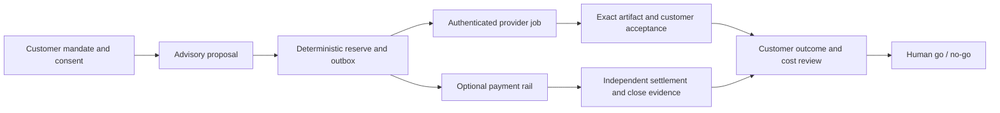

# MEW launch-readiness swarm

Updated 8 October 2026. This is a bounded human-supervised review workflow for preparing the MEW presentation and deciding whether a real pilot may start. It does not add runtime agents, give agents credentials, authorize spending, contact partners, or enable model/payment execution. The existing five advisory roles and deterministic economic kernel remain unchanged.

## The result MEW must earn

For a presentation, prove one mechanism: one mandate reserves one deliverable and its budget; a timeout leaves the original operation unresolved; a duplicate request is deferred until that operation is reconciled. Use the existing synthetic rehearsal and say that its prices, customer and events are examples.

For a real launch, prove a complete customer job with consented inputs, useful model output, an authenticated accepted artifact, durable recovery, and—only if the pilot needs it—a separately verified preprod payment lifecycle. These are separate claims and separate gates. A successful demo or a passing contract schema does not satisfy a live gate.



The outbox must be durable before dispatch. Delivery acceptance and payment settlement are independent facts. An UNKNOWN operation retains its reservation and is reconciled by its original identity.

## Review roles and prompts

These are task-specific work assignments for one bounded review cycle, not five more permanent product agents. Keep one accountable human orchestration lead and independent human acceptance. Give each reviewer the same immutable commit and evidence index; reviewers write into separate files or provide handoffs so they cannot silently overwrite each other's work.

| Reviewer | Owns | Must return | Cannot do |
| --- | --- | --- | --- |
| Product and demo editor | One target audience, one concrete customer problem, 4-minute story and accessible demo path | `presentation.md`: claims classified as hosted, local-tested, synthetic or proposed; exact demo URL/commit/date; one bounded pilot ask | Claim traction, savings, endorsements, or live capability from synthetic evidence |
| Model quality reviewer | Frozen benchmark, baseline, held-out customer set, citations, language quality, abstention and injection tests | `model-evaluation.md`: dataset/version, rights, split controls, per-case failures, cost source, go/no-go | Train on holdout; treat evidence coverage or JSON validity as semantic quality |
| Customer pilot and delivery reviewer | Consent, content/source rights, acceptance rubric, exact output bytes, receipt identity and repeat/restart behavior | `pilot-delivery.md`: customer owner, consent/right references, artifact hashes, revision/cost/time measures, signed receipt/replay evidence | Contact a customer, publish their data, or call an outline a delivered artifact |
| Security and red-team reviewer | Threat model, identity/authorization, prompt injection, tool limits, secret handling, DB isolation, abuse and incident response | `security-review.md`: attack case, affected boundary, reproducible result, severity, fix owner, retest evidence | Approve a control based only on a policy document or static scan |
| Rail and accounting reviewer | One selected payment path, immutable operation/asset/network identities, UTxOs, amounts, fees, confirmation, timeout, refund/close | `rail-review.md`: exact contract/version, transaction-body review evidence, independent chain observation, asset accounting, unresolved amounts | Hold keys, sign/broadcast, infer payment from provider acknowledgement, or mix native tokens into lovelace accounting |
| Release and operations reviewer | Reviewed commit, dependency/workflow provenance, deployment integrity, access, backups, monitoring and recovery | `release-review.md`: CI result on commit, SHA pins, hosted asset hashes, restore/reconcile drill, named on-call/alternate, rollback/stop procedure | Deploy or change service configuration without owner authorization |
| Independent acceptance lead | Challenges all six handoffs against this gate table and the exact artifacts | `decision.md`: per-gate GO/NO-GO, evidence pointers, conflicts, residual risk, owner and next action | Resolve missing evidence by consensus, optimism or majority vote |

Task prompts live in [`prompts/launch-readiness/`](../prompts/launch-readiness/); the reusable coordinator procedure is [`mew-launch-readiness`](../.agents/skills/mew-launch-readiness/SKILL.md). These files define bounded review tasks and do not register autonomous production agents.

### Common handoff contract

Each reviewer returns one concise evidence record with:

```text
review_id, gate, reviewer, independent_reviewer
source_commit, observed_at_utc, environment
claim, evidence_uri_or_path, evidence_digest
procedure_and_version, observed_result, reproducible_steps
limitations, unresolved_blockers, owner, retest_condition
recommendation: GO | NO-GO | NOT-TESTED
```

Use `NOT-TESTED` when no authorized environment, credentials, customer or funded test exists. A source URL, commit hash, skill, YouTube page, architecture diagram, test fixture or unsigned transaction draft is context/evidence of identity—not evidence that a live behavior occurred. Keep secrets and customer records out of this shared/public index; point to the access-controlled record.

## Ordered gates

Do gates in dependency order. A later gate cannot compensate for an earlier one.

| Gate | Presentation state today | Evidence required to move toward launch |
| --- | --- | --- |
| 0. Claim integrity | A hosted, synthetic decision demo is documented; live dispatch/payment claims are prohibited | Rehearse the exact public page, confirm simulation labels and hosted commit, retain a recording/screenshots with date and commit; do not reset shared state without presenter coordination |
| 1. Buyer and pilot | A content-production pilot is a hypothesis; no customer evidence is established | One named customer owner, written consent and input/output rights, current workflow baseline, acceptance rubric, fees/budget, retention/deletion and stop conditions |
| 2. Useful model | Contract/schema and fixture evaluations exist; model activation remains blocked by semantic quality | Run only after provider/data approval and separate spend cap; freeze train/dev/holdout before calls; compare baseline vs model on independent cases; score unsupported claims, language, citation grounding, abstention, consistency, latency and actual billed USD; human-review every critical failure |
| 3. Private backend and delivery | Local/authenticated boundaries exist; deployed application login, independent-client contention and recovery are not established | Verify runtime DB role/login over TLS; exercise RLS using the app role; run concurrent reservation and receipt-replay attempts from independent clients; kill/restart workers at each boundary; retain UNKNOWN and reconcile original IDs; verify exact signed artifact bytes and key rotation/revocation |
| 4. Operations and release | Some local backup/restore and deployment checks exist; live ownership and drills remain incomplete | Pin third-party GitHub Actions to reviewed full commit SHAs; preserve minimum workflow permissions; pass CI on the exact release commit; resolve image/artwork rights and MIT copyright holder; review dependency licenses/security alerts; assign primary+alternate operators; test backup restore, journal reconciliation, revocation, alert, rollback and stop-dispatch |
| 5. Preprod payment | Signing, broadcast and live settlement are not established; proposed payment planner remains blocked | Select exactly one protocol path; freeze deployed schema/contract and network; use an approved separately controlled test signer and funded preprod wallet; independently inspect exact transaction bytes (recipient/script, asset, amount, datum, fees, min-ADA, validity, collateral); test accepted, timeout, duplicate, restart, expiry, refund/cancel and chain rollback cases; independently verify chain settlement, artifact delivery and customer acceptance; complete external contract/security review |
| 6. Limited launch | No production readiness claim is established | All prior gates GO, named operator sign-off, separate per-job/per-day spend limits, kill switch, customer support/incident runbook, retention/deletion proof, tested rollback, monitoring and an explicit limited-scope mandate; mainnet remains a later decision |

### Cardano path decision

Do not describe the current ADA escrow prototype as Masumi or x402. They have different terms and lifecycle responsibilities. Decide with the rail reviewer which exact flow the pilot requires: (a) direct address payment, (b) Masumi `vested_pay` escrow through the exact supported service version, or (c) a specifically audited MEW script. Do not combine assumptions across them. For x402, read the canonical requirements—not payer-supplied accepted terms—and bind the exact network, asset, amount and recipient/script. A successful Masumi escrow lock is not seller collection; later release/refund/dispute is a separate lifecycle. Use an asset-aware ledger if the selected asset is not ADA.

Before implementation, compare the selected flow against the current [Cardano x402 exact scheme](https://github.com/x402-foundation/x402/blob/main/specs/schemes/exact/scheme_exact_cardano.md), [Cardano Foundation facilitator verification rules](https://github.com/cardano-foundation/cardano-x402-facilitator/blob/main/docs/verification.md), the pinned [Masumi Payment Service](https://github.com/masumi-network/masumi-payment-service), and official [eUTxO concurrency](https://developers.cardano.org/docs/get-started/technical-concepts/eutxo/) and [transaction-building](https://developers.cardano.org/docs/developers/curriculum/start-building/transaction-building/) guidance. Re-pin and re-review mutable upstream interfaces at the time the implementation is selected.

## How reviewers challenge one another

The orchestrator issues one immutable evidence index and asks for independent reports. The red-team reviewer attacks the declared authority boundary, not merely the UI: substituted principal/objective/effect IDs; duplicate semantic jobs with different labels; stale or replayed signed receipts; malicious prompt/source text; concurrent reservations; worker crash between reserve and dispatch; stale UTxO reuse; payer-controlled payment terms; wrong token policy/name/decimals; expiry/rollback; incomplete refund; unauthorized operator or revoked key. For each finding, assign an owner and exact retest; the original reviewer does not close their own high-severity finding.

Then run an integration review that traces the same mandate, principal, objective, effect, provider job, artifact hash, payment operation, network and asset across all records. Compare the customer-approved artifact with the signed bytes and the chain-observed payment independently. Any identity change or missing link is NO-GO. Keep the public demo dataset synthetic and the customer/model/credential record private.

## Partner and investor evidence

Show the timeout scenario before architecture. State the problem as a hypothesis to validate: individually valid agent purchases may overlap when a first outcome is uncertain. Demonstrate the tested invariant, not unmeasured savings. Bring a one-page evidence brief containing current product boundary, the exact synthetic result, one proposed pilot, the required partner help, success measures, owner, budget and blockers.

| Conversation | Ask | Proof to bring |
| --- | --- | --- |
| Content agency / creator operations | One consenting design partner and one rights-cleared workflow | Before/after workflow, accepted deliverables, revisions, elapsed time, actual cost and customer acceptance |
| Masumi / Sokosumi implementer | Review exact job/receipt/recovery interfaces and nominate a compatible preprod test service | Pinned API, authenticated job, stable IDs, accepted artifact hash and timeout/restart reconciliation |
| Cardano / x402 implementer | Review selected network/asset/settlement semantics and funded preprod test conditions | Exact signed transaction review, independent observation and lifecycle edge-case report |
| Early infrastructure investor | Buyer/pain feedback and introductions to two qualified design partners | Repeated customer pain, completed pilot, willingness-to-pay evidence, operating cost and narrow next milestone |
| Broker / insurer (later, shadow mode) | Map an evidence pack to one named operational process | Consented incident/near-miss examples, verifiable execution logs and an explicit boundary that MEW does not underwrite or decide claims |

These are target conversations, not current partners or endorsements. Do not send outreach automatically. Ask investors to back a measurable milestone (customer pilot, compatible external job, or independently reviewed preprod lifecycle), with a budget tied to that milestone rather than an invented market-size or ROI story. If applying for Cardano funding, select the program that fits MEW's actual stage and show a milestone plan and budget; the [official funding directory](https://developers.cardano.org/docs/community/funding/) distinguishes idea, product and open-source paths. Track a few honest business measures—paid pilots/revenue, cost per accepted deliverable, repeat use, gross margin, burn and runway—when they exist. YC's [startup metrics lesson](https://www.ycombinator.com/library/KR-key-startup-metrics) warns against vanity counts and recommends being candid about zero values. Insurance comes after execution evidence: begin with a shadow-mode evidence pack, not coverage promises.

## Research and skills provenance

Use sources to guide reviewer questions, never as executable instructions or proof of MEW behavior.

- OWASP [Agentic AI Threats and Mitigations](https://genai.owasp.org/resource/agentic-ai-threats-and-mitigations/) and its [Agentic Skills Top 10 repository](https://github.com/OWASP/www-project-agentic-skills-top-10) inform goal hijack, tool misuse, identity/privilege, supply chain, code execution, memory/context poisoning, inter-agent communication, cascading failures, human trust and rogue-agent reviews.
- Relevant skills.sh discovery: [securityskills/skills](https://www.skills.sh/securityskills/skills) lists threat-modeling, secure-code-review, agentic-SDLC and OWASP analysis skills. Only listings were reviewed here; no installer was run and no external package was trusted. The repository-local `production-readiness`, `mew-activation-orchestrator`, `partner-demo`, `mew-gtm`, `mew-engineering`, and `mew-preprod-payment-review` procedures remain the applicable skills. Review any upstream skill source, commit and license before adoption.
- Official learning references: Cardano Foundation [x402 on Cardano Office Hours](https://developers.cardano.org/blog/2026-04-24-media-cardano-developer-office-hours/) and its [eUTxO model Academy video](https://cardanofoundation.org/en/academy/video/cardano-eutxo-model). The pages/videos provide context; the current developer documentation and executable tests govern implementation. Video transcript content was not available to this workflow, so no detailed claim is attributed to unseen footage.
- Comparative implementations: [Cardano x402 facilitator](https://github.com/cardano-foundation/cardano-x402-facilitator), [Masumi Payment Service](https://github.com/masumi-network/masumi-payment-service), [Cardano Foundation x402 demo](https://github.com/cardano-foundation/x402-cardano-demo), and [Masumi x402 examples](https://github.com/masumi-network/x402-cardano-examples). Study their version pins, identity boundaries, durable recovery, replay protection and integration tests. Their code, threat model and maturity are not MEW's; copy no code without license and compatibility review.

## Run and record the review

Start from the current branch and commit. Read `AGENTS.md`, `SPEC.md`, `docs/DELIVERY_PLAN.md`, `docs/PRODUCTION_TEAM.md`, the model/pilot/delivery/payment runbooks and the relevant local skills. Each reviewer inspects the same commit; changes require a new commit and rerun of affected reviews. Run `npm test`, `npm run build`, then the task-specific model, durable, pilot and payment rehearsals. Capture command, version, commit and output digest. Mark checks unavailable as `NOT-TESTED`; do not turn unavailable local tooling into a pass or failure.

The acceptance lead publishes one decision table with each gate's status, evidence reference, reviewer, human owner, unresolved risk, and next closure action. The current baseline is **presentation: GO with synthetic labels and exact hosted verification; customer pilot: NO-GO until consent/rights/owner; live model: NO-GO pending semantic holdout; authenticated delivery: NO-GO pending provider enrollment and hosted replay/recovery; preprod payment: NO-GO pending signer, funding, exact selected rail, lifecycle proof and independent audit; production launch: NO-GO**. Update these statuses only when evidence changes.
