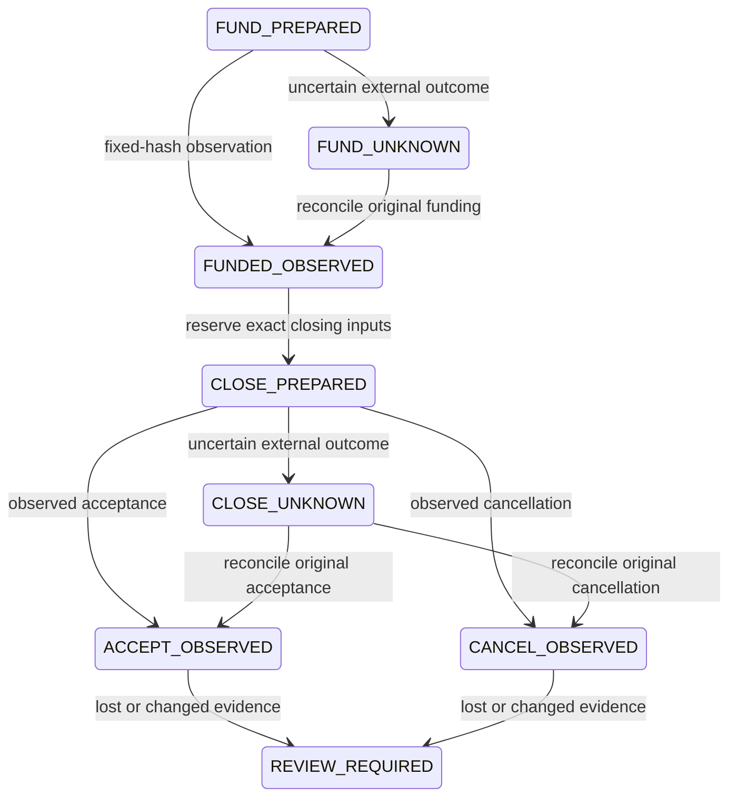

# MEW payment system: Cardano preprod implementation

MEW now connects its existing compiled ADA approval-escrow contract to a durable
funding/closing journal and an offline external-witness assembler. The private
API can prepare acceptance or cancellation, preserve an uncertain close across
restart, and observe the original transaction. It never invokes a wallet or
submits a transaction. Public website state and model output cannot approve funds.

The first supported rail is **ADA on Cardano preprod**, not mainnet or Masumi tUSDM.
Private Supabase application connectivity, approved custody, live funds, exact-body
ledger evaluation and an independent contract audit remain pending. This is a
runnable implementation and local rehearsal, not an activated commercial rail.

## Contract and authority

The unchanged Plutus V3 validator is
`contracts/approval-escrow/validators/approval_escrow.ak`; its compiled interface is
`contracts/approval-escrow/plutus.json`. It protects one ADA-only job cell:

- Funding locks the exact escrow amount with a versioned inline datum containing
  principal/provider addresses and objective, effect and artifact commitments.
- Acceptance consumes that exact output, needs principal and provider required
  signatures, and pays the entire locked amount to the provider's full address.
- Cancellation needs the principal signature and returns the entire escrow amount
  to the principal's full address. Fees come from a separate input.
- The validator rejects script batching, continued escrow outputs, recipient-owned
  fee inputs, native assets, minting, withdrawals and substituted datum or payout.

The artifact digest is committed **before funding**. This contract is suitable for
approval of a known artifact commitment; it does not implement a future-output
commit/reveal job. Principal cancellation is available immediately, even after
provider work. Provider compensation, deadlines, arbitration and lost-key recovery
are not guaranteed. A commercial agreement or separately reviewed contract version
must address those business rules before use. Do not rename this as Masumi escrow.

Global quantity/budget admission remains deterministic and off-chain. The script
cannot authenticate MEW's original funding event or prevent duplicate job digests
in other cells. The durable store binds the exact locally computed funding hash
and output index; closing requests cannot supply another cell or rewrite an intent.
The full encoding and 49 handler-test cases are in [APPROVAL_ESCROW.md](APPROVAL_ESCROW.md).

## Durable workflow



The diagram's observations are fixed-hash indexer observations, not absolute
finality or release permissions. Provider failure before confirmation retains
UNKNOWN. Changed/deeper-insufficient observations require review. A funding block
change also blocks closing progression, and a close reported earlier than its
funding block is rejected. REVIEW_REQUIRED is sticky; another good response does
not clear it. Historical outcome data may remain for investigation and must not
override the current status.

`prepareClosing` runs under the existing principal row lock and database transaction.
It derives the funding cell, datum and payout from the saved operation, validates
fee/collateral caps, and persists an immutable close plus globally unique input locks
atomically. An identical replay returns DEFER; changed identity, action or body
inputs fail. It supports one close attempt only: an expired or abandoned draft
cannot be replaced automatically because external signing/submission may be unknown.
Recovery/replacement requires a separately reviewed evidence protocol.

Acceptance additionally requires the existing authenticated delivery receipt and
delivery contract to match the artifact committed in the funding datum. This is an
off-chain release-preparation policy; the smart contract itself checks the digest
and signatures, not content quality or the receipt protocol.

Closing fee and collateral inputs must use the enrolled principal's payment key.
Third-party fee sponsors are rejected. For cancellation, use another full address
with that same payment key and separately selected UTxOs: the payout address itself
cannot contribute consumed fee inputs. This avoids requiring the provider to sponsor
the principal's cancellation. An arbitrary address or provider key does not qualify.
Fresh ownership/unspentness and wallet support still need verification before signing.

Funding reservations already include the escrow amount, funding fee cap, closing
fee cap and collateral allowance. Closing does not reserve the same job twice.
Every fee input, collateral input and the original escrow cell is locked; existing
lock conflicts roll back the entire preparation. Locks are conservatively retained.

**Returning escrow is not a refund of the full reserved exposure.** Actual funding
fees may already be spent, and collateral/closing costs require reconciliation.
Therefore neither acceptance nor cancellation automatically settles or refunds the
aggregate kernel effect. The journal records observed payout and fee amounts while
`overheadAccountingVerified=false`. Full exposure stays committed, with
`settlementClaimProduced=false`, `refundClaimProduced=false` and
`exposureReleaseAllowed=false`. Safe partial-cost accounting and input unlocks remain
a separate audited prerequisite; do not call the retained allowance revenue.

## Private API and setup

Use the existing machine-to-machine private integration host from
[SUPABASE_MODEL_PAYMENTS.md](SUPABASE_MODEL_PAYMENTS.md). Browser Origin requests are
rejected, and public Supabase Auth sessions confer no payment authority. No new
database migration or role grants are required for closing; data resides in the
existing escrow operation record and input-lock tables. No live database was accessed
or altered in this contribution. Previously enrolled payment scopes do not acquire
closing authority automatically.

| POST route | Explicit operator scope | Exact body fields |
| --- | --- | --- |
| `/integration/payment/prepare` | `prepare-payment` | `operationId`, `providerId`, funding `args` |
| `/integration/payment/unknown` | `prepare-payment` | `operationId` |
| `/integration/payment/reconcile` | `reconcile-payment` | `operationId` |
| `/integration/payment/closing/prepare` | `prepare-closing` | `operationId`, `closingId`, `action`, `inputs`, `feeAddress`, `collateral`, `parameters`, `executionUnits` |
| `/integration/payment/closing/unknown` | `prepare-closing` | `operationId`, `closingId` |
| `/integration/payment/closing/reconcile` | `reconcile-closing` | `operationId`, `closingId` |

Closing `action` is `accept` or `cancel`. The key UTxOs, parameter snapshot and measured
execution units use the existing builder format. Callers cannot add an `intent`,
`escrowInput`, principal, verified flag, transaction hash or dispatch permission.
The store derives those bindings. Input snapshots marked `preprod-observed` are
operator data, not proof of live chain observation. Drafts remain unsigned and gated.

Enroll the two new scopes explicitly in the private operator token configuration
only when the owner needs preparation/reconciliation. There are no sign/submit routes.
Provider lookup is fixed to the preprod origin, GET-only, timeout-bound, response-size
bounded, and rejects reported redirects/foreign URLs. Responses and credentials are
not exposed in errors. A missing or malformed provider response never frees capacity.

## External signatures, assembled offline

[CIP-30](https://cips.cardano.org/cip/CIP-30) returns a transaction witness set from
`signTx`, rather than a full transaction. MEW's helper accepts **already supplied key
witness sets**; it never calls signTx, creates a key, signs or submits anything.

```sh
npm run escrow:assemble-witnesses -- \
  /absolute/operator-args.json /absolute/witness-sets.json /absolute/fresh-output
```

The witness JSON is an array of lowercase CBOR hex strings. Operator args are the
original builder arguments, not a caller-chosen expected hash. The helper rebuilds
the unsigned draft, verifies permitted keys and signatures against the body hash,
deduplicates identical returned keys, and preserves the original raw body, auxiliary
data and existing script witnesses. Wallet-supplied non-key witnesses are rejected.
Partial results list missing keys. Final assembled size/fee checks still apply.

The new owner-only output directory contains `transaction.cbor.hex` and `assembly.json`.
Even a complete valid-signature report retains signing/dispatch/payments disabled.
Stale original parameters fail; do not refresh them silently beneath existing
signatures. Fresh chain inputs, protocol parameters, exact script execution and
approved external custody are separate facts that these signatures do not prove.
See [MODEL_PAYMENT_UNBLOCKING.md](MODEL_PAYMENT_UNBLOCKING.md).

## Run the local payment demo

```sh
npm run payment:lifecycle-rehearse
npm test
npm run build
```

The rehearsal exercises actual PostgreSQL SQL in local PGlite, real unsigned CBOR,
fixture merchant receipt signatures and synthetic provider observations for both
acceptance and cancellation. It demonstrates UNKNOWN handling, immutable replay
and retained exposure. All output is explicitly synthetic. It makes no network or
model request and invokes no wallet. The test suite additionally closes/reopens a
file-backed PGlite engine to check persisted closing state and locks. Its serialized
connection does not prove multi-client hosted PostgreSQL contention or crash recovery.

Contract reproduction remains:

```sh
cd contracts/approval-escrow
../../.local/aiken/aiken-aarch64-apple-darwin/aiken check --deny
../../.local/aiken/aiken-aarch64-apple-darwin/aiken build --deny
```

The compiler and stdlib remain pinned; no validator, blueprint hash or on-chain
address was replaced. Verification evidence is in
`research/activation/payment-system-2026-10-08`.

## Before real funds

Provide a private least-privilege database login and prove runtime TLS connectivity,
multi-client contention and recovery. Approve an external signer and exact debit
caps, obtain funded preprod UTxOs, independently reobserve/lock selected inputs, and
evaluate the final transaction against current node parameters. Commission an
independent audit covering the unchanged contract and new durable closing workflow,
cost conservation, cancellation economics, replay, rollback and recovery. Then perform
funded accept/cancel lifecycles with independently observed evidence. Keep model
advice separate from the principal's actual transaction approval.

Masumi tUSDM needs a separately reviewed multi-asset contract and durable token/ADA
overhead ledger. The ADA validator intentionally rejects native tokens; no currency
conversion, MPS purchase/withdrawal or token-payment deployment was added here.
