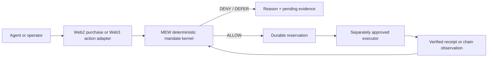

# MEW product build and release SOP

Use this short path for new MEW product work. `SPEC.md` owns economic invariants, `AGENTS.md` owns engineering rules, and `DEPLOYMENT.md` owns environment setup. This SOP joins product decisions to the existing build and release gates.

## 1. Design around one user task

Start with a real operator and one costly moment, not a department or agent count.

**Current lead workflow:** an agent requests a report from Supplier Alpha; the response times out; it considers Supplier Beta. The buyer needs to know if the same report is still reserved, whether another purchase is allowed, and what evidence resolves the uncertainty.

Write a one-sentence task, the user's desired outcome, the decision that changes, and one observable pass/fail measure. For this flow: “After an ambiguous supplier response, prevent a second equivalent commitment until the first outcome is reconciled.” Measure duplicate dispatches, correct defer decisions and evidence completeness. Use synthetic inputs until a customer approves a pilot.

Do five short design checks before coding:

1. **Observe:** identify the user's actual sequence and current workaround; record facts separately from assumptions.
2. **Frame:** state user, trigger, consequence and success measure in one sentence.
3. **Sketch:** draw the request → decision → external observation → resolution path. Show DENY, DEFER and failure states alongside the happy path.
4. **Test:** walk one customer/operator through a low-fidelity example. Ask what they think happens next; fix confusing terms before expanding scope.
5. **Commit:** freeze acceptance examples, owning files, existing contracts and explicit non-goals for the work package.

## 2. Keep the system small



Keep one deterministic kernel, one durable economic ledger and thin domain adapters. Reuse common identity, mandate, idempotency and evidence fields. Keep purchase fulfillment, trading positions, chain settlement and insurance coverage in domain-specific schemas. Models can summarize or suggest; they do not approve spending, sign, dispatch, reconcile, release exposure or decide a claim.

The diagram is the target boundary; the current demo stops at deterministic simulation and verified observations. It does not dispatch payments or trades.

Use only the specialists the work needs: a product/design owner for task clarity, an engineer for one implementation boundary, and an independent risk/QA reviewer for acceptance. One accountable lead integrates the result. Do not fan every task out to the entire company catalog.

## 3. Implementation acceptance

Before editing, record:

- user story and concrete failure example;
- changed files/modules and preserved API/schema contracts;
- synthetic or live data status and source rights;
- expected output and deterministic acceptance check;
- rollback/recovery behavior and the unresolved risk owner.

For anything touching money or execution, include retry, timeout/UNKNOWN, duplicate identity, concurrency, stale evidence and restart cases. Reserve before any external handoff. A timeout never frees capacity. If the work is presentation-only, verify the task remains understandable without reading technical vocabulary and that simulation status is visible at the point of action.

## 4. Local release gate

Node 24+ is required. From a clean checkout:

```sh
npm ci --ignore-scripts
npm run check
```

For the container path:

```sh
docker build -t mew:review .
docker run --rm -p 3000:3000 -v mew-review-data:/data mew:review
```

Confirm the health route reports demo mode, SQLite persistence and payments disabled. Open the demo and exercise the timeout → equivalent request → DEFER case. Do not mount a production data volume or provide credentials during this rehearsal.

## 5. Deploy to the existing Railway demo

The existing Railway service currently tracks `feat/cardano-agent-boundaries`; a push to that branch automatically deploys to the production demo. Treat a push as a production release and complete review/tests first. Verify the live commit and assets after every push.

1. Review `git diff`, `npm run check` and the exact commit. Confirm no secrets, private customer records or local database files entered the change.
2. Push the authorized branch only after review and tests. The connected service auto-deploys; do not separately stage or accept a second deployment for the same commit. Preserve the existing volume, region, replica and resource limits.
3. Wait for Railway to report deployment success and a healthy service. Run `npm run deploy:verify` from the same checkout to compare hosted assets with local bytes and verify the demo boundary.
4. Open the hosted decision flow. Confirm the page labels synthetic activity and the timeout case still defers the equivalent request. Record commit, deployment ID, health result, test count and any observed limitation in `docs/LIVE_DEPLOYMENT.md`.
5. If health or byte checks fail, stop the release, preserve the last healthy revision, inspect logs and revert the Railway source pin to that revision. Do not toggle model/payment flags to repair a presentation deployment.

Track spend against the approved account budget; Railway resource limits do not enforce a dollar cap. No extra worker, replica, database or paid model is needed for a demo-only release.

## 6. Pilot and later execution gates

Run customer work in shadow mode first. Get written consent and source/data rights, freeze the event definitions, agree a deletion date and compare against a customer-approved baseline. Track false allows, false defers, duplicate dispatches, review time, latency and accepted evidence. Customer acceptance is required before calling the pilot successful.

Trading dispatch and insurance integration are separate projects. Trading requires its own venue/order/position model, oracle and liquidity freshness, slippage/fees, liquidation checks, signer isolation and reconciliation. Insurance requires an authorized partner to define policy terms, exclusions, limits and claims decisions. MEW can provide evidence; it must not promise coverage. Keep both paths in simulation until their independent security, legal, custody and partner gates pass.

## 7. One-page work-package record

Copy this into each task/PR description:

```text
User + trigger:
Desired outcome / measure:
Changed boundary + owner:
Acceptance cases:
Data/source rights:
Deployment target + exact revision:
Recovery / rollback:
Unresolved risk + decision owner:
Evidence recorded:
```
